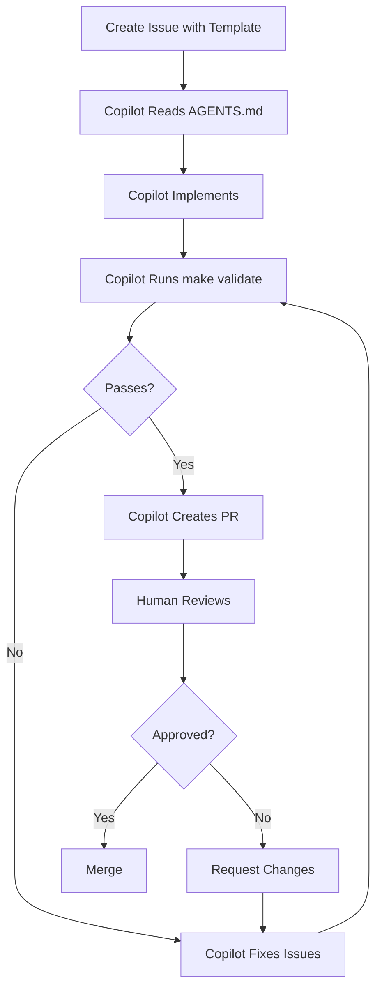

# GitHub Copilot Agent Mode Guide

**Using GitHub Copilot Agent Mode with the Vibecode Blueprint (2025-2026)**

## Overview

GitHub Copilot's **agent mode** and **coding agent** capabilities enable
autonomous code generation, testing, and iteration within your GitHub workflow.
This guide shows how to use Copilot effectively with the Vibecode Blueprint.

## What is Copilot Agent Mode?

**Agent Mode** allows GitHub Copilot to:

- Autonomously implement features from issue descriptions
- Run tests and observe failures
- Self-correct based on test output
- Iterate until validation passes
- Create pull requests with complete implementation

**Key Difference from Traditional Copilot**:

- **Traditional**: Suggests code completions as you type
- **Agent Mode**: Autonomously implements entire features end-to-end

## Quick Start

### 1. Enable Copilot for Your Repository

```bash
# Ensure Copilot has access to your repository
# Settings → GitHub Copilot → Enable for this repo
```

### 2. Create Agent-Friendly Issues

Use the provided issue template (`.github/ISSUE_TEMPLATE/agent-feature.md`):

```markdown
## Feature Request

**Description**: Clear, concise description of what to build

**Acceptance Criteria**:

- [ ] Criterion 1 (testable)
- [ ] Criterion 2 (testable)
- [ ] Validation passes (`make validate`)

**Test Strategy**: How to verify this works

**Context**: Links to related code, docs, or designs
```

### 3. Let Copilot Implement

1. Assign issue to Copilot agent
2. Copilot reads AGENTS.md for project guidelines
3. Copilot implements feature
4. Copilot runs `make validate`
5. Copilot iterates until tests pass
6. Copilot creates PR

### 4. Review and Merge

- Review Copilot's PR using the agent-specific checklist
- Check that validation passed
- Verify acceptance criteria are met
- Merge when satisfied

## Best Practices

### Issue Creation

**✅ DO**:

- Provide clear, measurable acceptance criteria
- Link to relevant code or documentation
- Specify validation requirements explicitly
- Include examples of expected behavior
- Reference AGENTS.md for coding standards

**❌ DON'T**:

- Be vague ("make it better")
- Skip acceptance criteria
- Forget to mention testing requirements
- Leave out context or examples

**Example - Good Issue**:

```markdown
## Add User Profile API Endpoint

**Description**: Create a GET /api/users/:id endpoint that returns user profile
data

**Acceptance Criteria**:

- [ ] Endpoint responds with 200 for valid user IDs
- [ ] Returns 404 for non-existent users
- [ ] Response includes: id, name, email, bio, createdAt
- [ ] TypeScript types are defined in shared-types package
- [ ] Unit tests cover happy path and error cases
- [ ] `make validate` passes

**Test Strategy**:

- Unit tests with mocked database
- Integration test with test database
- Golden test for response format

**Context**:

- See existing endpoints in `packages/api/src/routes/`
- Response format: [API Response Standard](../docs/api-standards.md)
- Related: #123 (User authentication)
```

**Example - Bad Issue**:

```markdown
## Fix the user thing

Make the user stuff work better. It's broken.
```

### Agent-Loop Pattern

Copilot agent mode works best with clear feedback loops:

```
1. Read requirements (issue description)
2. Read AGENTS.md (project guidelines)
3. Implement feature
4. Run `make validate`
5. Observe failures (if any)
6. Fix issues
7. Repeat steps 4-6 until clean
8. Create PR
```

**Blueprint Support**: This repo's AGENTS.md is optimized for this pattern.

### Validation Requirements

**CRITICAL**: Always require agents to run validation before finishing:

```markdown
**Acceptance Criteria**:

- [ ] All tests pass
- [ ] `make validate` completes successfully
- [ ] No ESLint errors
- [ ] Prettier formatting applied
- [ ] TypeScript compiles without errors (if applicable)
```

This is **mandatory** - never skip validation requirements.

### Scope Control

Keep issues focused to prevent scope creep:

**✅ DO**: "Add email validation to the signup form" **❌ DON'T**: "Improve the
entire authentication system"

**Guideline**: One issue = one PR = one feature or fix

### Context Provision

Help agents find what they need:

```markdown
**Context**:

- Related code: `src/auth/signup-handler.ts:45-67`
- Existing tests: `tests/auth/signup.test.ts`
- Type definitions: `packages/shared-types/src/auth.ts`
- Similar implementation: See `login-handler.ts` for pattern
```

## Workflow Patterns

### Pattern 1: Feature Development



### Pattern 2: Bug Fix

1. **Create bug report** with reproduction steps
2. **Agent reproduces** the bug with a failing test
3. **Agent fixes** the issue
4. **Agent verifies** the test now passes
5. **Agent runs** full validation
6. **Agent creates** PR with fix and test

### Pattern 3: Refactoring

1. **Define goal** clearly ("Extract validation logic to shared utility")
2. **Specify contracts** (interfaces must not change)
3. **Require golden tests** to pass (no regression)
4. **Agent refactors** implementation
5. **Agent verifies** contracts and golden tests unchanged
6. **Human reviews** for architectural correctness

## Integration with Blueprint

### AGENTS.md Integration

The blueprint's AGENTS.md includes a section specifically for Copilot:

```markdown
### GitHub Copilot Agent Mode / Coding Agent

- **Config**: `.github/` workflows optimized for agent mode
- **Guidance**: See `docs/guides/COPILOT_AGENT_MODE.md` (this file)
- **Best Practices**:
  - Use issue/PR templates with clear acceptance criteria
  - Require `make validate` before done
  - Document decisions in PR descriptions
  - Use agent task checklist template
```

Copilot agents should:

1. **Read AGENTS.md first** every session
2. **Follow setup commands** to understand project structure
3. **Use validation commands** before marking tasks complete
4. **Reference quality standards** for code coverage and testing

### Issue Templates

Located in `.github/ISSUE_TEMPLATE/`:

- `agent-feature.md` - Feature requests for agents
- `agent-bug.md` - Bug reports for agents
- `agent-refactor.md` - Refactoring tasks for agents

Each template includes:

- Clear structure for requirements
- Acceptance criteria checklist
- Validation requirements
- Context section
- Test strategy

### PR Template

Located in `.github/PULL_REQUEST_TEMPLATE/agent-pr.md`:

Includes:

- What changed and why
- Acceptance criteria verification
- Validation evidence
- Breaking changes (if any)
- Test coverage
- Agent task checklist

## Advanced: Agent Task Checklist

For complex tasks, use the agent task checklist template:

```markdown
# Agent Task Checklist: [Feature Name]

## Planning Phase

- [ ] Read AGENTS.md for project guidelines
- [ ] Review related code and documentation
- [ ] Understand acceptance criteria
- [ ] Identify files to modify
- [ ] Plan testing strategy

## Implementation Phase

- [ ] Implement feature following patterns
- [ ] Add unit tests
- [ ] Add integration tests (if applicable)
- [ ] Update documentation
- [ ] Run `make lint`
- [ ] Run `make format`

## Validation Phase

- [ ] All new tests pass
- [ ] All existing tests still pass
- [ ] `make validate` completes successfully
- [ ] TypeScript compiles (if applicable)
- [ ] No ESLint errors
- [ ] Prettier applied

## Review Phase

- [ ] Code follows project patterns
- [ ] Tests are comprehensive
- [ ] Documentation is updated
- [ ] Breaking changes documented
- [ ] PR description is complete

## Risks Identified

- Risk 1: [Description]
- Risk 2: [Description]

## Follow-up Tasks

- [ ] Task 1
- [ ] Task 2
```

This checklist is available as a template in `.github/agent-task-checklist.md`.

## Common Patterns

### Pattern: Database Migration

```markdown
## Issue: Add User Bio Field

**Acceptance Criteria**:

- [ ] Migration adds `bio` column to users table
- [ ] Migration is reversible (down migration)
- [ ] User model includes bio field
- [ ] API returns bio in user responses
- [ ] Tests updated for new field
- [ ] `make validate` passes

**Migration Strategy**:

1. Create migration file
2. Update TypeScript types
3. Update API response serializer
4. Add tests for bio field
5. Run migration in test environment
6. Verify rollback works
```

### Pattern: API Endpoint Addition

```markdown
## Issue: Add Search Endpoint

**Acceptance Criteria**:

- [ ] GET /api/search?q=term implemented
- [ ] Returns paginated results (limit, offset)
- [ ] Handles empty query gracefully
- [ ] Returns 400 for invalid parameters
- [ ] Integration tests cover all cases
- [ ] OpenAPI/Swagger docs updated
- [ ] `make validate` passes

**Context**:

- Follow existing pagination pattern in /api/users
- Use same error response format
- See docs/api-standards.md for response structure
```

### Pattern: Component Refactoring

```markdown
## Issue: Extract Button Component

**Acceptance Criteria**:

- [ ] Button component extracted to packages/shared-ui
- [ ] All existing Button uses migrated
- [ ] Props interface well-typed
- [ ] Storybook stories added
- [ ] Unit tests for component
- [ ] Golden tests unchanged (no visual regression)
- [ ] `make validate` passes

**Contracts**:

- Existing Button API must not change (props same)
- All consuming components must work unchanged
- Golden tests must pass (proving no regression)

**Context**:

- Current Button uses: components/forms/, components/modals/
- See packages/shared-ui/README.md for package structure
```

## Troubleshooting

### Agent Not Following Guidelines

**Problem**: Copilot ignores AGENTS.md or doesn't run validation

**Solution**:

1. Ensure AGENTS.md is in repository root
2. Add explicit instruction in issue:
   ```markdown
   **Important**: Read AGENTS.md before starting. Run `make validate` before
   creating PR.
   ```
3. Include validation in acceptance criteria (not optional)

### Agent Gets Stuck in Loop

**Problem**: Agent keeps trying same failing approach

**Solution**:

1. Provide more specific hints in issue
2. Link to similar working code
3. Break task into smaller issues
4. Provide example test case

### Tests Keep Failing

**Problem**: Agent can't get tests to pass

**Solution**:

1. Ensure test expectations are correct
2. Provide test examples in issue
3. Check if acceptance criteria are achievable
4. Consider if issue scope is too large

### PR Quality Issues

**Problem**: PR doesn't meet standards despite passing validation

**Solution**:

1. Update AGENTS.md with specific patterns
2. Add golden tests for expected output
3. Make quality standards explicit in acceptance criteria
4. Provide examples of good PRs

## Security Considerations

### Secrets and Credentials

**Always include** in acceptance criteria:

```markdown
- [ ] No hardcoded secrets or API keys
- [ ] Environment variables used for sensitive config
- [ ] .env.example updated with new vars
- [ ] Security scan passes
```

### Input Validation

For endpoints or forms:

```markdown
- [ ] All user inputs validated
- [ ] SQL injection prevented (parameterized queries)
- [ ] XSS prevented (sanitized output)
- [ ] CSRF protection in place
```

### Dependency Updates

When adding dependencies:

```markdown
- [ ] Dependency has no known vulnerabilities
- [ ] License is compatible (MIT, Apache, etc.)
- [ ] Dependency audit passes
- [ ] Justified in PR description
```

## Metrics and Success Criteria

Track these metrics to measure agent effectiveness:

- **Acceptance rate**: % of PRs merged without human code changes
- **Iteration count**: # of validation runs before passing (lower is better)
- **Time to PR**: Time from issue creation to PR (faster is better)
- **Test coverage**: % of new code covered by tests (higher is better)
- **Rollback rate**: % of merged PRs that needed reverting (lower is better)

**Target benchmarks**:

- Acceptance rate: >80%
- Iteration count: <3 runs
- Test coverage: >80%
- Rollback rate: <5%

## See Also

- [AGENTS.md](../../AGENTS.md) - Primary AI agent interface
- [Agent Feature Template](.github/ISSUE_TEMPLATE/agent-feature.md)
- [Agent PR Template](.github/PULL_REQUEST_TEMPLATE/agent-pr.md)
- [Agent Task Checklist](.github/agent-task-checklist.md)

---

**Last Updated**: January 2025 **Maintained By**: Blueprint Maintainers

_This guide is part of the Vibecode Blueprint's 2025-2026 modernization for
agentic coding._
